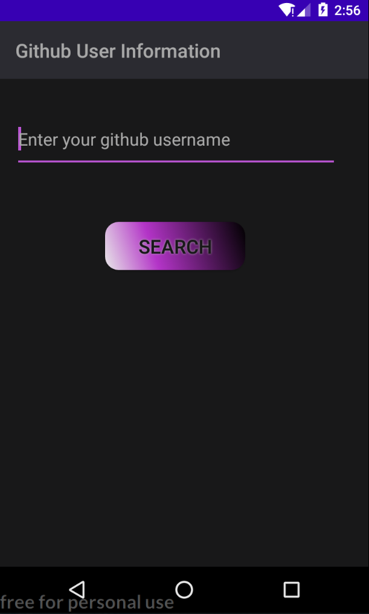
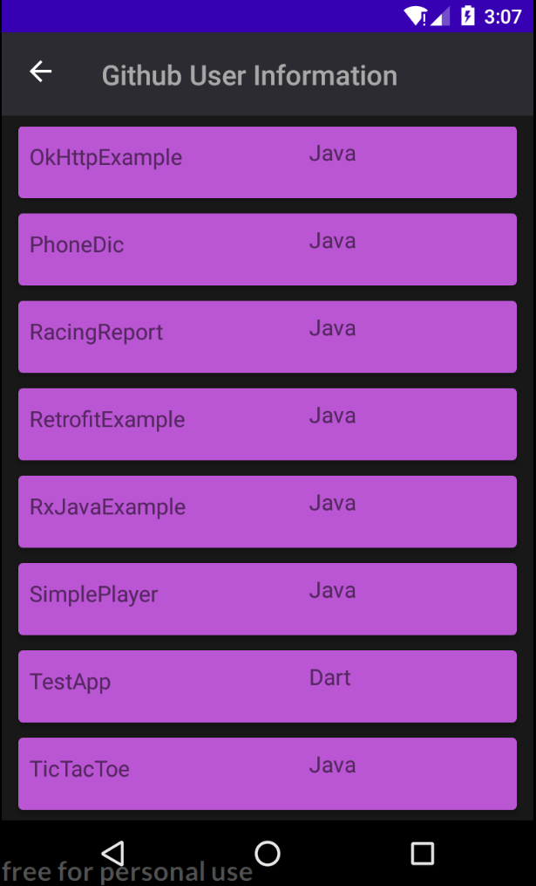

# GithubUserInformation

This is my pet project as part of my mobile development course.

-The app has the 2 screens.This app is a simple client for GitHub.
On the first screen, enter the name of the GitHub user, and on the second screen, display a list of projects for this user

- User Activity

- List of progect Activity

